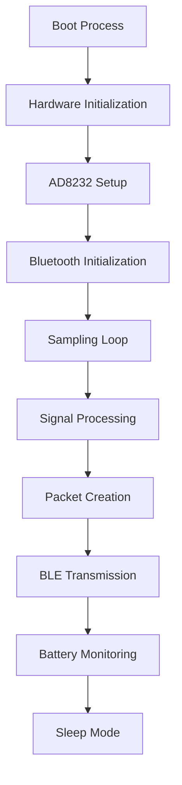

# ESP32 Firmware Architecture

## Scope

This document describes the conceptual firmware architecture for the Heart-O-Care Pocket ECG Device. It does not define production firmware, implementation APIs, timing values, packet formats, or power-management thresholds.

## Firmware Flow

The flow shows the major firmware responsibilities in their intended lifecycle order. In a future implementation, monitoring and transmission activities may operate repeatedly while the device is active; the diagram does not prescribe a specific execution model.

## Modules

### Boot Process

The boot process is the firmware entry point after the ESP32 powers on or wakes. Its role is to establish the initial device state before hardware and communication services are prepared.

### Hardware Initialization

Hardware initialization prepares the ESP32 and the connected device peripherals for operation. This module is responsible for ensuring that the hardware foundation is ready before ECG acquisition begins.

### AD8232 Setup

The AD8232 setup module prepares the ECG front-end for signal acquisition. It defines the architectural boundary between the firmware and the AD8232 sensor hardware.

### Bluetooth Initialization

Bluetooth initialization prepares Bluetooth Low Energy communication with the Flutter Mobile App. This module establishes the device-side communication capability before data is transmitted.

### Sampling Loop

The sampling loop is responsible for repeatedly obtaining ECG signal data from the hardware path while the device is active. It is the firmware boundary where raw acquisition enters the software flow.

### Signal Processing

Signal processing receives acquired ECG signal data and prepares it for the next stage. The document does not define filtering, analysis, or clinical interpretation behavior.

### Packet Creation

Packet creation organizes processed signal data into a transportable representation for Bluetooth Low Energy transmission. The packet structure and contents remain to be defined in a future firmware specification.

### BLE Transmission

BLE transmission sends created packets from the ESP32 to the connected Flutter Mobile App. This module is the firmware-side output boundary for mobile communication.

### Battery Monitoring

Battery monitoring observes the device power state so that firmware can make appropriate future power-management decisions. It is conceptually separate from ECG acquisition and Bluetooth communication.

### Sleep Mode

Sleep mode represents the low-power device state used when active monitoring or communication is not required. The conditions for entering or leaving sleep mode remain to be defined.

## Architectural Boundaries

- The **AD8232 Setup** and **Sampling Loop** modules form the acquisition side of the firmware.
- The **Signal Processing** and **Packet Creation** modules form the data-preparation side.
- The **Bluetooth Initialization** and **BLE Transmission** modules form the mobile communication side.
- The **Battery Monitoring** and **Sleep Mode** modules form the future power-management side.

This separation is intended to keep future firmware work understandable and maintainable as the device evolves.
