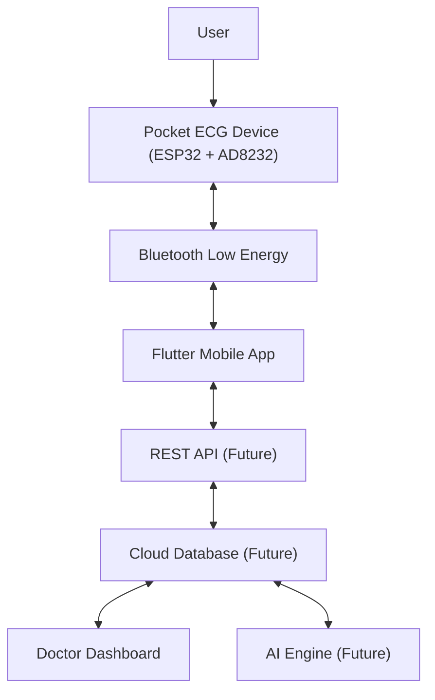

# Heart-O-Care System Architecture

## Scope

This document describes the conceptual architecture for Heart-O-Care. It records the currently identified components and future integration boundaries without prescribing production implementation details.

## High-Level Architecture

The mobile application is the connection between the Pocket ECG Device and future cloud services. The Doctor Dashboard and AI Engine are separate consumers of future cloud data, rather than a required sequential step between one another.

## Components

### Hardware

The Pocket ECG Device is the physical Heart-O-Care device. The identified hardware foundation includes an ESP32 and an AD8232 ECG front-end for portable ECG acquisition.

### Firmware

Firmware is the software running on the Pocket ECG Device. Its architectural role is to coordinate the hardware components and make device data available to the mobile application through Bluetooth Low Energy.

### Bluetooth Low Energy

Bluetooth Low Energy is the local communication boundary between the Pocket ECG Device and the Flutter Mobile App. It enables the device and application to exchange information while they are connected.

### Flutter Mobile App

The Flutter Mobile App is the user-facing mobile layer. It connects to the device through Bluetooth Low Energy and is the planned client for future REST API communication.

### Backend

The REST API is a future backend boundary between mobile clients and cloud services. Its role is to provide a defined communication path for future application and platform capabilities.

### Cloud Database

The Cloud Database is a future persistent data layer. It is the planned shared boundary for future API, Doctor Dashboard, and AI Engine interactions.

### Doctor Dashboard

The Doctor Dashboard is the clinician-facing layer. It is intended to use future cloud data for reviewing reports and supporting informed care decisions.

### Website

The website is the public information layer for Heart-O-Care. It communicates the product vision, device concept, ecosystem, and project progress; it is separate from the device monitoring data path described above.

### Desktop Software

Desktop Software is the workstation-oriented visualization and reporting component. It supports the broader Heart-O-Care ecosystem alongside the mobile application and may evolve with future clinical workflows.

### AI Engine

The AI Engine is a future component for AI-assisted ECG analysis. Its planned architectural relationship is with the future Cloud Database rather than directly with the Pocket ECG Device.

## Communication Boundaries

### ESP32 and Flutter Mobile App

The ESP32-based Pocket ECG Device and the Flutter Mobile App communicate through Bluetooth Low Energy. This is the local device-to-mobile connection.

### Flutter Mobile App and REST API

The Flutter Mobile App and the REST API are a future client-to-backend boundary. This connection is planned to support future cloud-connected workflows.

### REST API and Cloud Database

The REST API and Cloud Database are future backend-to-data boundaries. The API is the planned path between application services and persistent cloud data.

### Cloud Database and Doctor Dashboard

The future Cloud Database and Doctor Dashboard form the planned data-to-clinician boundary. The dashboard is intended to use available reports and related information for review.

### AI Engine and Cloud Database

The future AI Engine and Cloud Database form the planned analysis-to-data boundary. AI-assisted analysis is intended to work with future cloud data rather than bypassing the platform data layer.

## Future Scalability

The architecture is intended to evolve beyond a single device and user without changing the core device-to-mobile-to-cloud direction.

- **Multiple devices:** The platform can grow to support more than one Pocket ECG Device across the broader ecosystem.
- **Multiple users:** The mobile and future cloud layers can evolve to support multiple people using Heart-O-Care.
- **Doctors:** The Doctor Dashboard provides a distinct clinician-facing layer as the system expands.
- **Hospitals:** Future cloud and dashboard boundaries provide a conceptual path for broader healthcare organization use.

The specific implementation approach for multi-device coordination, user management, doctor access, hospital workflows, data storage, and AI operation remains intentionally undefined in this architecture document.
